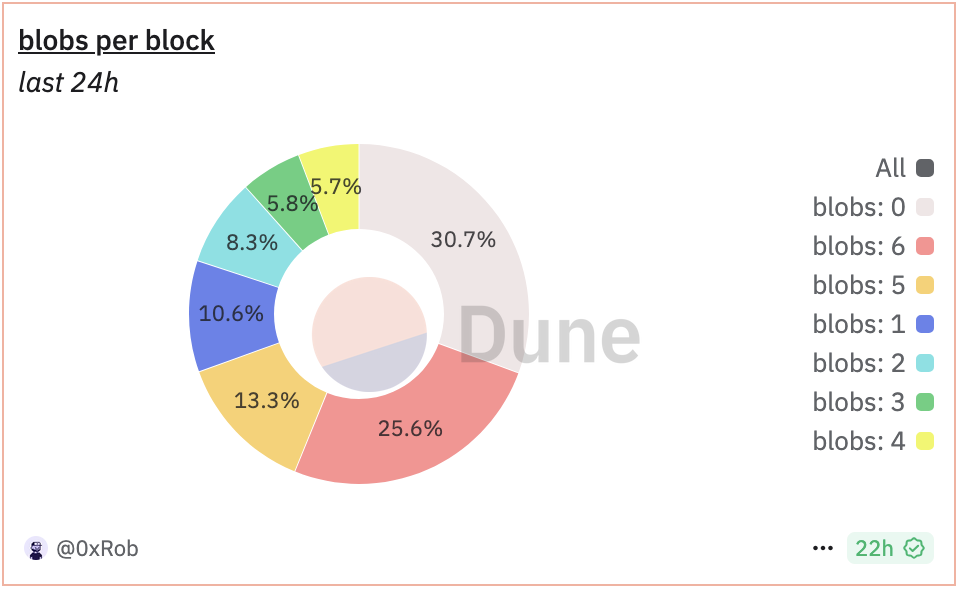

# Simulating the process of blob price discovery under various demand distributions

## Introduction

EIP-4844 introduces a new transaction type to Ethereum that accepts ‘blobs’ of data, enhancing scalability for rollups by providing a more cost-effective data availability layer. As expected, rollup costs have dropped significantly due to the cheaper ‘blob’ resource. However, the overall price of blobs has remained exceptionally low for an extended period, raising concerns within the community about whether rollups are contributing enough to the mainnet.

The prevailing explanation for the persistently low blob prices is the [cold-start problem](https://ethresear.ch/t/eip-4844-fee-market-analysis/15078), initially predicted by [Davide Crapis](https://x.com/DavideCrapis). This theory suggests that it could take 1 to 1.5 years for blob demand to grow enough for prices to exceed 1 wei. However, in reality, prices remain low throughout a day, even as average blob consumption has approached the target value of 3.

In this research, I try to
- Find out how much blob demand needs to be created to bring the blob fee market into equilibrium
- Describe the blob demand paradox
- Simulate where the blob fee is headed after the Pectra fork


## The blob fee mechanism

The blob fee structure is governed by a base fee update rule, which approximates the formula:
```
base_fee_per_blob_gas = MIN_BASE_FEE_PER_BLOB_GAS * e**(excess_blob_gas / BLOB_BASE_FEE_UPDATE_FRACTION)
```

In this equation, `excess_blob_gas` is the total "extra" amount of blob gas that the chain has consumed relative to the "targeted" number (`TARGET_BLOB_GAS_PER_BLOCK` per block). Like EIP-1559, it's a self-correcting formula: as the excess goes higher, the `base_fee_per_blob_gas` increases exponentially, reducing usage and forcing the excess back down. Eventually `base_fee_per_blob_gas` goes toward a level at which rollups perceive it as a “fair” price.

The block-by-block behavior is roughly as follows. If block `N` consumes `X` blob gas, then in block `N+1` `excess_blob_gas` increases by `X - TARGET_BLOB_GAS_PER_BLOCK`, and so the `base_fee_per_blob_gas` of block `N+1` increases by a factor of `e**((X - TARGET_BLOB_GAS_PER_BLOCK) / BLOB_BASE_FEE_UPDATE_FRACTION)`.

The parameter `BLOB_BASE_FEE_UPDATE_FRACTION` controls the maximum rate of change of the base fee per blob gas. It is chosen to target a maximum change rate of `e**(TARGET_BLOB_GAS_PER_BLOCK / BLOB_BASE_FEE_UPDATE_FRACTION) ≈ 1.125` per block.


## How blob demand effect the blob price

To gain initial insights into how blob demand impacts blob fees through the mechanism mentioned above, we conducted five simulations under different conditions to observe the changes in `excess_blob_gas` and `base_fee_per_blob_gas`

The parameters are set as same as EIP-4844.
- `TARGET_BLOB_PER_BLOCK`: 3
- `MAX_BLOBS_PER_BLOCK`: 6
- `MIN_BASE_FEE_PER_BLOB_GAS`: 1 wei
- `BLOB_BASE_FEE_UPDATE_FRACTION`: 3338477

### Case 1: The blob demand follows a Poisson distribution with lambda = 1

The mean and variance of blob consumption per block are both 1, which is below `TARGET_BLOB_PER_BLOCK`, indicating an oversupply situation. As expected, the results show that `base_fee_per_blob_gas` remains at the `MIN_BASE_FEE_PER_BLOB_GAS` value.


### Case 2: The blob demand follows a Poisson distribution with lambda = 5

The mean and variance of blob consumption per block are both 5, which is more than `TARGET_BLOB_PER_BLOCK`, indicating higher-than-desired blob demand. If demand remains high, `excess_blob_gas` will continue to increase, causing `base_fee_per_blob_gas` to rise exponentially. As expected, the results confirm this trend.


### Case 3: The blob demand follows a Poisson distribution with lambda = 3

The mean blob consumption per block is 3, matching TARGET_BLOB_PER_BLOCK, representing a balanced state. In this scenario, `base_fee_per_blob_gas` is expected to remain stable without any upward or downward trend. The results confirm this, showing that `base_fee_per_blob_gas` stays at `MIN_BASE_FEE_PER_BLOB_GAS`, even though `excess_blob_gas` is higher than in Case 1.


### Case 4: The blob demand follows an uniform distribution

The mean of the blob consumption per block is 3, which is same as the case 3. The variance of it is 4.0, which is more than the case 3. That means the blob usage is more volatile in this situation.
The result shows `excess_blob_gas` grows toward a level at which `base_fee_per_blob_gas` is above `MIN_BASE_FEE_PER_BLOB_GAS`. And `excess_blob_gas` and `base_fee_per_blob_gas` tend to reach an equilibrium after a period of time.

The mean blob consumption per block is 3, the same as in Case 3, but with a higher variance of 4.0, indicating greater volatility in blob usage. The results show that `excess_blob_gas` increases to a level where `base_fee_per_blob_gas` rises above `MIN_BASE_FEE_PER_BLOB_GAS`. Over time, both `excess_blob_gas` and `base_fee_per_blob_gas` tend to stabilize, reaching an equilibrium.


### Case 5: The blob demand follows a bimodal distribution with mean = 3

What happens when blob demand becomes highly volatile? In Case 5, there is a 50% chance of consuming 0 blobs and a 50% chance of consuming 6 blobs. Despite this fluctuation, the mean of blob consumption remains 3, equal to TARGET_BLOB_PER_BLOCK, but with a higher variance of 9.0.
The results are similar to Case 4, where `excess_blob_gas` and `base_fee_per_blob_gas` tend to gradually stabilize over time. However, both values in Case 5 are higher than those observed in Case 4.


## Insufficient demand, Effective demand, Excess demand

Based on the results above, we can categorize blob demand growth into three stages:
- **Insufficient Demand**: In this stage, `excess_blob_gas` doesn't increase, and `base_fee_per_blob_gas` stays at `MIN_BASE_FEE_PER_BLOB_GAS`.
- **Effective Demand**: Both `excess_blob_gas` and `base_fee_per_blob_gas` gradually stabilize, reaching an equilibrium over time.
- **Excess Demand**: `excess_blob_gas` grows linearly, while `base_fee_per_blob_gas` rises exponentially.


## Find the effective demand in the blob fee market

The next question explores how many consumed blobs per block would establish market equilibrium from scratch.

Under assumption that blob demand follows a Poisson distribution. We conducted simulations with means ranging from 3 to 4, using increments of 0.01.

The results indicate that effective demand falls between 3.13 and 3.20 blobs. When consumption drops below 3.13 blobs, demand becomes insufficient. Conversely, when consumption exceeds 3.20 blobs, demand becomes excess.


## Blob demand paradox

The pricing mechanism aims to control blob usage at a specific target value. However, a paradox emerges when this target falls outside the range of effective demand. In such cases, the blob fee market cannot reach equilibrium despite average blob usage approximating the target value, or equilibrium can only be achieved by consuming more blobs than the target specifies.

Demand variance represents another critical factor. As variance increases, the range of effective demand widens correspondingly. This explains why we achieve equilibrium in Cases 4 and 5, where the target value falls within the expanded effective demand range.


## EIP-4844 status quo

Based on current data from Dune, the distribution of `blobs_per_block` more closely resembles Case 5. Optimism rollups typically utilize 5 or 6 blobs, while ZK rollups prefer 1 or 2 blobs. This pattern has fortunately spared the Ethereum ecosystem from confronting the demand paradox.

However, demand must still remain within the effective demand range for 1.5-2 days to achieve market equilibrium. Unfortunately, we have yet to meet this criterion in the year following the EIP-4844 launch.




## EIP-7691 Analysis

EIP-7691, scheduled for implementation in the upcoming Pectra fork, will increase the number of blobs per block to enhance Ethereum's scalability through L2 solutions that depend on L1 data capacity. Under this proposal, `MAX_BLOBS_PER_BLOCK` will increase to 9, while `TARGET_BLOBS_PER_BLOCK` will increase to 6. The `BLOB_BASE_FEE_UPDATE_FRACTION` has been set at 5007716 to account for the asymmetry between target and maximum values.

The economic implications of these parameters on the blob fee market require thorough evaluation. We are conducting simulations under various demand variance conditions to determine the effective demand range under this new configuration.


In either case, `excess_blob_gas` fails to accumulate and `base_fee_per_blob_gas` remains fixed at `MIN_BASE_FEE_PER_BLOB_GAS`. This indicates that the target blob demand is insufficient no matter what variance is.

Our calculations place effective demand between 6.57 and 6.72 blobs, suggesting a high probability that the blob fee market will face the demand paradox. When the market consumes an average of 6 blobs, it still cannot reach equilibrium or discover the fair price. To force the market toward equilibrium, consumption would need to exceed 6.57 blobs per block, significantly surpassing the target value.


## What can we do?

### Idea 1: Making the base fee scaling symmetric ensures the mechanism stays as-is

To avoid the demand paradox, implementing symmetric base fee scaling is crucial. This approach would allow blob fees to scale by ±12.5% at the extremes of empty and full blocks. We should reconsider the parameters in EIP-7961, as the proposed changes might actually worsen the blob fee market's current state. From an economic perspective, viable target/maximum blob configurations could be 4/8, 5/10, or 6/12

### Idea 2: Increase minimum price

EIP-7762 proposes increasing MIN_BASE_FEE_PER_BLOB_GAS to accelerate price discovery for blob space. Let's conduct a brief analysis.

We can define the cold-start time as the sum of demand growth time and price response time. Demand growth time represents how long it takes for blob demand to rise from 0 to the effective demand level. Price response time measures how quickly blob demand reflects in pricing. In simulated environments, setting a higher minimum price does reduce price response time. Conversely, this approach might impede demand growth.

However, no strong correlation exists between blob price and demand since blob demand functions as a derivative demand. Blob gas pricing doesn't directly impact end users. Rollups may ultimately need to bear higher blob fees for Ethereum's broader benefit.

### Idea 3: Set a high initial value of `excess_blob_gas`

Determining a fair price for blob data is crucial in many aspects. A healthy blob fee market not only stabilizes public sentiment, thereby influencing ETH's price, but also fosters greater confidence in the rollup-centric roadmap.

To efficiently discover this fair price, we can implement a mechanism similar to a Dutch auction by initially setting a high `excess_blob_gas` value, which translates to a high `base_fee_per_blob_gas`. This fee will gradually decrease until demand rises to meet the effective demand. While building demand from the ground up might take months, a Dutch auction-like process could potentially achieve price discovery within days.


## Refeerences

- [EIP-4844](https://eips.ethereum.org/EIPS/eip-4844)
- [EIP-7691](https://eips.ethereum.org/EIPS/eip-7691)
- [EIP-7762](https://eips.ethereum.org/EIPS/eip-7762)
